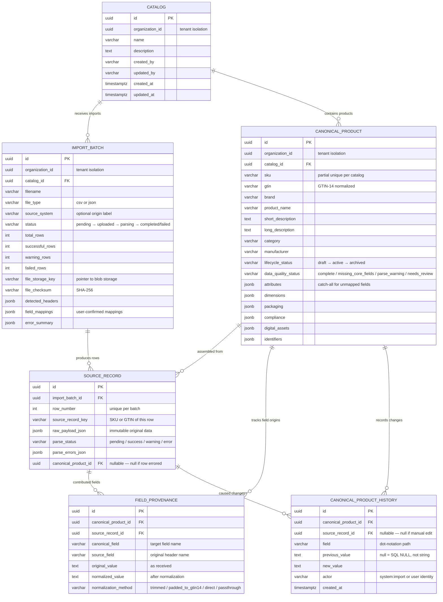

# Data Kitchen Data Model

> **Last updated:** 2026-08-02
> **Scope:** Step 1 — Real Catalog Intake, Canonical Product Model, and Persistence
> **Prisma schema:** `server/prisma/schema.prisma`
> **Custom migration:** `server/prisma/migrations/00000000000000_init/migration.sql`

---

## Why This Schema Exists

Data Kitchen solves a specific problem: retail product data arrives from many sources, in many formats, with inconsistent naming, missing fields, and duplicate records. The schema is designed to answer three questions that every downstream step — readiness scoring, mapping, validation, delivery, and feedback — depends on:

1. **What is the current best-known state of each product?** → `canonical_product`
2. **Where did each piece of data come from?** → `source_record` + `field_provenance`
3. **What changed, when, and why?** → `canonical_product_history`

Every other table exists to support these three answers. The schema intentionally separates concerns that could be merged into a single table but should not be — because the lifecycle, access patterns, and retention policies of each concern are fundamentally different.

---

## Entity Relationship Diagram



---

## Tables

### Catalog

**Purpose:** A named container that groups products for a specific business context — a brand's product line, a seasonal collection, a supplier's inventory. It is the top-level organizational unit within a tenant.

**Why it exists as a separate table:** Without catalogs, all products would exist in a flat, tenant-wide namespace. SKU uniqueness would need to be global (impossible in practice — different suppliers reuse SKUs). Catalogs also provide the natural scope for import operations, readiness scoring, and delivery payloads.

**Why it should not be merged with `canonical_product`:** Products need a grouping boundary that is independent of any single product. Import batches target a catalog, not a product. Readiness scoring evaluates a catalog against a retailer schema. Delivery generates a payload for a catalog. Removing the catalog table would push this grouping logic into every downstream query.

**Relationships:**
| Direction | Table | Cardinality | FK | On Delete |
|---|---|---|---|---|
| Parent of | `canonical_product` | One-to-many | `canonical_product.catalog_id` | RESTRICT |
| Parent of | `import_batch` | One-to-many | `import_batch.catalog_id` | RESTRICT |

**Lifecycle:**
1. **Created** — explicitly by the user, or auto-created as "Default Catalog" when `GET /catalogs` finds none for the organization.
2. **Active** — receives imports, contains products, serves as the scope for downstream pipeline steps.
3. **Never deleted** — `ON DELETE RESTRICT` on both child tables prevents deletion while products or imports exist. This is intentional: deleting a catalog would destroy audit trails.

**Indexes:**
| Index | Columns | Type | Purpose |
|---|---|---|---|
| `catalog_pkey` | `id` | Primary key | Row identity |
| `idx_catalog_org` | `organization_id` | B-tree | Tenant isolation — every query filters by org |

**Business Rules:**
- A catalog belongs to exactly one organization. There is no cross-org catalog sharing.
- Catalog names are not required to be unique (users may have "Fall 2026" in multiple orgs).
- The auto-create behavior (`GET /catalogs` creates a default) ensures the frontend always has a catalog to target, even on first use.

**Future Evolution:**
- Catalog-level settings (default field mappings, preferred retailers, quality thresholds) will be added as columns or a linked settings table.
- Catalog archival status will gate whether new imports are accepted.

---

### ImportBatch

**Purpose:** Records one file upload and its processing outcome. An import batch is the audit record of "what was uploaded, by whom, when, how it was mapped, and what happened."

**Why it exists as a separate table:** The import batch captures metadata about the upload event — filename, file type, storage location, checksums, field mappings, row counts, errors. This metadata has a completely different lifecycle from the products it creates. Products evolve across many imports; the import record is immutable after completion. Merging import metadata into products would lose the one-to-many relationship between batches and source records, and would make it impossible to answer "show me everything that happened in this upload."

**Why it should not be merged with `source_record`:** A source record is one row from one file. An import batch is the file-level envelope — it knows the filename, the field mappings that were applied, the total counts, and the storage key for the raw file. Without this separation, file-level metadata would be duplicated across every row.

**Relationships:**
| Direction | Table | Cardinality | FK | On Delete |
|---|---|---|---|---|
| Child of | `catalog` | Many-to-one | `import_batch.catalog_id` | RESTRICT |
| Parent of | `source_record` | One-to-many | `source_record.import_batch_id` | RESTRICT |

**Lifecycle:**
```
pending → uploaded → parsing → completed
                           └──→ failed
```

1. **Pending** — initial state (default).
2. **Uploaded** — file stored in blob storage, headers parsed, preview generated. The batch now has `detected_headers`, `file_storage_key`, `file_checksum`, and `total_rows`.
3. **Parsing** — `confirmImport` called, file re-downloaded, row-by-row processing in progress. `field_mappings` are stored at this point.
4. **Completed** — all rows processed. `successful_rows`, `warning_rows`, `failed_rows` are final. `error_summary` contains any warnings and errors.
5. **Failed** — every row in the batch errored. Terminal state.

A completed or failed batch cannot be re-imported. The batch is immutable after reaching a terminal state.

**Indexes:**
| Index | Columns | Type | Purpose |
|---|---|---|---|
| `import_batch_pkey` | `id` | Primary key | Row identity |
| `idx_import_batch_catalog` | `catalog_id` | B-tree | List imports for a catalog |
| `idx_import_batch_org` | `organization_id` | B-tree | Tenant isolation |

**Business Rules:**
- An import batch targets exactly one catalog. A single file cannot be imported into multiple catalogs.
- The file is stored in blob storage *before* any database writes. If storage fails, no batch record is created.
- Field mappings are user-confirmed. The system suggests mappings via alias matching, but the user must confirm before import proceeds.
- Row counts (`successful_rows`, `warning_rows`, `failed_rows`) are updated as a final step, not incrementally, to avoid partial state if the process crashes.
- `file_checksum` (SHA-256) is stored for future deduplication — detecting re-uploads of the same file.

**Future Evolution:**
- Async import: the batch status will gain an `in_progress` state with a job ID, and results will be polled rather than returned synchronously.
- Re-import: a "re-import" action will create a *new* batch pointing to the same storage key, with potentially different field mappings. The original batch is never modified.
- Source system tracking will become richer — linked to a registered source system table rather than a free-text string.

---

### CanonicalProduct

**Purpose:** The single source of truth for a product within a catalog. Every downstream pipeline step — readiness scoring, mapping, validation, delivery, and feedback — reads from this table. It represents the best-known state of a product, assembled from one or more source records across one or more imports.

**Why it exists as a separate table:** Source records are raw, immutable, and per-row. A product may be assembled from 5 source records across 3 imports — each contributing different fields, correcting previous values, or filling in gaps. The canonical product is the *resolved* state: the current best-known value for each field after all imports have been applied. Without this table, every consumer would need to re-derive the current state by replaying the full import history.

**Why it should not be merged with `source_record`:** Source records are immutable (the raw data as received). Canonical products are mutable (updated by every subsequent import that touches the same SKU/GTIN). Source records have a 1:1 relationship with rows in an uploaded file. Canonical products have a 1:many relationship with source records. The data lifecycle, update semantics, and query patterns are completely different.

**Relationships:**
| Direction | Table | Cardinality | FK | On Delete |
|---|---|---|---|---|
| Child of | `catalog` | Many-to-one | `canonical_product.catalog_id` | RESTRICT |
| Parent of | `source_record` | One-to-many | `source_record.canonical_product_id` | SET NULL |
| Parent of | `field_provenance` | One-to-many | `field_provenance.canonical_product_id` | RESTRICT |
| Parent of | `canonical_product_history` | One-to-many | `canonical_product_history.canonical_product_id` | RESTRICT |

**Lifecycle:**

The canonical product has two independent status dimensions:

**Lifecycle status** (`lifecycle_status`):
```
draft → active → archived
```
- **Draft** — newly created from an import. Not yet reviewed or approved.
- **Active** — reviewed and approved for downstream pipeline steps.
- **Archived** — no longer active. Preserved for audit purposes.

**Data quality status** (`data_quality_status`):
```
complete | missing_core_fields | parse_warning | needs_review
```
- **Complete** — all four core fields (SKU, product name, brand, category) are present.
- **Missing core fields** — one or more core fields are null.
- **Parse warning** — the source row had parse warnings (e.g., extra columns, encoding issues).
- **Needs review** — the product has no SKU and no GTIN, making duplicate detection impossible. Requires human review.

These two statuses are orthogonal. A product can be `active` + `missing_core_fields` (approved despite incomplete data) or `draft` + `complete` (fully populated but not yet reviewed).

**Indexes:**
| Index | Columns | Type | Purpose |
|---|---|---|---|
| `canonical_product_pkey` | `id` | Primary key | Row identity |
| `idx_product_org` | `organization_id` | B-tree | Tenant isolation |
| `idx_product_status` | `(catalog_id, data_quality_status)` | B-tree | Filter products by quality status within a catalog |
| `idx_product_sku_catalog` | `(catalog_id, sku) WHERE sku IS NOT NULL` | **Partial unique** | SKU uniqueness within a catalog, ignoring null SKUs |
| `idx_product_gtin_catalog` | `(catalog_id, gtin) WHERE gtin IS NOT NULL` | Partial B-tree | GTIN-based duplicate lookup |

The partial unique index on `(catalog_id, sku)` is defined via custom SQL because Prisma does not support `WHERE` clauses on `@@unique`. The import service handles the Prisma `P2002` error code that this index produces on duplicate SKU insertion.

**Business Rules:**
- **Typed core fields:** 8 columns with explicit PostgreSQL types (`varchar`, `text`) — `sku`, `gtin`, `brand`, `product_name`, `short_description`, `long_description`, `category`, `manufacturer`. These are the fields that every retailer expects. Typed columns enable SQL-level indexing, uniqueness constraints, and efficient filtering.
- **Flexible JSONB fields:** 6 JSONB columns — `attributes`, `dimensions`, `packaging`, `compliance`, `digital_assets`, `identifiers`. These hold product data that varies by retailer, category, or source system. The `attributes` field is the catch-all: any unmapped source field lands here automatically.
- **GTIN normalization:** All GTINs are normalized to GTIN-14 format (left-padded with zeros). UPC-12, EAN-13, and GTIN-8 inputs are all stored as 14-digit strings, enabling consistent duplicate detection.
- **Non-destructive updates:** When a duplicate is detected during import, only non-null incoming values overwrite existing values. A null or empty incoming field never erases existing data. This prevents a sparse second import from degrading a product that was previously complete.
- **Product identity:** `canonical_product.id` (UUID) is the stable product identity through Steps 1–5. A separate `product_identity` table is deferred until AI reconciliation (Step 6+) requires cross-product identity grouping. See `server/prisma/ADR-001-product-identity.md`.

**Future Evolution:**
- `product_identity_id` FK — links to a deferred `product_identity` table for AI-driven product reconciliation.
- Retailer-specific validation status fields or a linked validation result table.
- Full-text search index on `product_name` + `brand` + `category` for faster search queries.
- Computed readiness score columns or a linked readiness table per retailer.

---

### SourceRecord

**Purpose:** The immutable, verbatim record of one row from one imported file, exactly as it was received. Source records exist so that Data Kitchen never loses the original data, no matter how many times the canonical product is updated, corrected, or enriched.

**Why it exists as a separate table:** The canonical product is a *derived* state — it is assembled from source records by applying field mappings, normalization rules, and duplicate resolution logic. If the system ever needs to answer "what did the source actually send?", the source record is the authoritative answer. This is critical for:
- **Audit trails:** Regulators and retailers may require proof of what data was received and when.
- **Debugging:** When a canonical product has a wrong value, source records show which import introduced it.
- **Re-import:** If field mappings were wrong, source records allow re-processing without re-uploading.
- **AI training:** Source records provide the labeled training data for future field-mapping AI — the raw input paired with the human-confirmed field mappings.

**Why it should not be merged with `canonical_product`:** A canonical product can be assembled from 1, 5, or 50 source records across multiple imports. Merging would lose the import history. Source records are immutable; canonical products are mutable. Source records record what was received; canonical products record the current best-known state. These are fundamentally different concerns with different retention and access patterns.

**Why it should not be merged with `import_batch`:** A batch is the file-level envelope. Source records are the row-level contents. Merging would lose the ability to query individual rows, track which row produced which product, or surface row-level parse errors.

**Relationships:**
| Direction | Table | Cardinality | FK | On Delete |
|---|---|---|---|---|
| Child of | `import_batch` | Many-to-one | `source_record.import_batch_id` | RESTRICT |
| Child of | `canonical_product` | Many-to-one (nullable) | `source_record.canonical_product_id` | SET NULL |
| Parent of | `field_provenance` | One-to-many | `field_provenance.source_record_id` | RESTRICT |
| Parent of | `canonical_product_history` | One-to-many | `canonical_product_history.source_record_id` | SET NULL |

The `canonical_product_id` FK is nullable because a source record may have failed to parse or may not have matched any product (parse status = `error`). The `ON DELETE SET NULL` ensures that if a canonical product is removed, the source record survives — the raw data is preserved even if the derived product is gone.

**Lifecycle:**
1. **Created** during import — one source record per row in the uploaded file.
2. **Immutable** after creation — `raw_payload_json` is never updated.
3. `parse_status` is set at creation time and never changes:
   - `success` — row parsed, normalized, and linked to a canonical product.
   - `warning` — row parsed with warnings (e.g., extra columns), still linked to a product.
   - `error` — row failed to parse or process. `canonical_product_id` is null.

**Indexes:**
| Index | Columns | Type | Purpose |
|---|---|---|---|
| `source_record_pkey` | `id` | Primary key | Row identity |
| `uq_source_record_batch_row` | `(import_batch_id, row_number)` | Unique | Prevents duplicate rows within a batch |
| `idx_source_record_batch` | `import_batch_id` | B-tree | List all rows in a batch |
| `idx_source_record_product` | `canonical_product_id` | B-tree | Find all source records for a product |

**Business Rules:**
- `raw_payload_json` is stored as-is from the parsed CSV/JSON row. No normalization, no field renaming, no whitespace trimming. This is the verbatim source data.
- `source_record_key` stores the SKU or GTIN extracted from the row (whichever is available), for display purposes. It is not used for duplicate detection — that happens on the canonical product table.
- `row_number` is the 1-based position in the uploaded file. Combined with `import_batch_id`, it uniquely identifies a source row.
- Error rows are still persisted (with `parse_status = "error"` and `canonical_product_id = NULL`) so that the batch's error count is auditable and error details are queryable.

**Future Evolution:**
- `reprocessed_at` timestamp for re-import tracking.
- `superseded_by` FK to support source record versioning (a corrected upload supersedes a previous one).
- Full-text index on `raw_payload_json` for cross-import search.

---

### FieldProvenance

**Purpose:** Records exactly how each field on a canonical product was populated — which source field it came from, what the original value was, what the normalized value is, and what normalization method was applied. Provenance is the link between "what the source sent" and "what the canonical product shows."

**Why it exists as a separate table:** A canonical product has ~14 fields (8 core + 6 JSONB). Each field may have been populated by a different source record, from a different import, with a different field mapping. Storing provenance inline on the canonical product (e.g., as JSONB metadata per field) would create a deeply nested, hard-to-query structure that grows unboundedly as imports accumulate. A separate table provides:
- **Per-field querying:** "Which source populated the brand field?" is a simple WHERE clause.
- **Time-ordered history:** Provenance records are append-only with timestamps, showing the succession of values for each field.
- **Normalization transparency:** Users can see that their "UPC" column was mapped to "gtin" and that "012345678901" was padded to "00012345678901" via `padded_to_gtin14`.
- **AI training data:** Each provenance record is a labeled example of (source_field, original_value) → (canonical_field, normalized_value) with a method label.

**Why it should not be merged with `source_record`:** A source record contains the entire raw row. Provenance tracks the per-field mapping from that row to the canonical product. One source record may generate 8 provenance entries (one per mapped core field). The granularity is different: source records are row-level; provenance is field-level.

**Why it should not be merged with `canonical_product_history`:** Provenance records what a field's value *is* and where it came from. History records what a field's value *was* before it changed. Provenance is created for every field on every import (even the first). History is only created when an existing value changes. They answer different questions: provenance answers "where did this value come from?"; history answers "what was the previous value?"

**Relationships:**
| Direction | Table | Cardinality | FK | On Delete |
|---|---|---|---|---|
| Child of | `canonical_product` | Many-to-one | `field_provenance.canonical_product_id` | RESTRICT |
| Child of | `source_record` | Many-to-one | `field_provenance.source_record_id` | RESTRICT |

Both FKs are non-nullable. A provenance entry always links to both a canonical product and a source record. `ON DELETE RESTRICT` on both prevents orphaned provenance data.

**Lifecycle:**
1. **Created** during import — one provenance record per mapped field per source record.
2. **Immutable** after creation — provenance is append-only. When a new import updates a field, a new provenance record is created; the old one is not modified or deleted.
3. The most recent provenance record for a given `(canonical_product_id, canonical_field)` represents the current mapping.

**Indexes:**
| Index | Columns | Type | Purpose |
|---|---|---|---|
| `field_provenance_pkey` | `id` | Primary key | Row identity |
| `idx_provenance_product` | `canonical_product_id` | B-tree | All provenance for a product |
| `idx_provenance_source` | `source_record_id` | B-tree | All provenance from a source record |

**Business Rules:**
- `normalization_method` is one of: `trimmed` (whitespace removed), `padded_to_gtin14` (UPC/EAN padded to 14 digits), `direct` (GTIN already 14 digits), `passthrough` (GTIN with non-standard length, stored as-is).
- `original_value` is the raw value from the source row, before any transformation.
- `normalized_value` is the value after normalization, which is what gets stored on the canonical product.
- Unmapped fields (those that land in `attributes` JSONB) do not generate provenance records in Step 1. This is a deliberate scope reduction — provenance tracks mapped core fields only.

**Future Evolution:**
- Provenance for JSONB attribute fields (not just core fields).
- Confidence scores from AI-suggested mappings.
- `superseded_by` FK for tracking which provenance record replaced a previous one.
- Composite index on `(canonical_product_id, canonical_field, created_at)` for efficient "latest provenance for field X" queries.

---

### CanonicalProductHistory

**Purpose:** An append-only change log that records every modification to a canonical product's fields. When a re-import updates a product's brand from "Acme" to "Acme Corp", the history table records: field = "brand", previous = "Acme", new = "Acme Corp", actor = "system:import", with a link to the source record that triggered the change.

**Why it exists as a separate table:** The canonical product table reflects current state. History reflects *all previous states*. These are different temporal models with different query patterns:
- Current state: `SELECT * FROM canonical_product WHERE id = ?` (fast, indexed, single row).
- Change history: `SELECT * FROM canonical_product_history WHERE canonical_product_id = ? ORDER BY created_at DESC` (potentially many rows, time-ordered).

Storing history inline (e.g., as JSONB on the product) would make the product row grow unboundedly, degrade update performance, and make time-range queries impractical.

**Why it should not be merged with `field_provenance`:** Provenance is created on *every* import, for *every* mapped field — even when the value doesn't change. History is created *only* when a value actually changes. Provenance answers "where did this value come from?"; history answers "what was the value before?". A product imported 10 times may have 80 provenance records (8 fields × 10 imports) but only 3 history records (3 actual field changes across those 10 imports).

**Relationships:**
| Direction | Table | Cardinality | FK | On Delete |
|---|---|---|---|---|
| Child of | `canonical_product` | Many-to-one | `canonical_product_history.canonical_product_id` | RESTRICT |
| Child of | `source_record` | Many-to-one (nullable) | `canonical_product_history.source_record_id` | SET NULL |

The `source_record_id` FK is nullable because future changes may come from manual edits, AI agents, or API updates rather than imports. `ON DELETE SET NULL` preserves the history record even if the triggering source record is removed.

**Lifecycle:**
1. **Created** during import — only when `diffProductFields()` detects that an existing field value changed.
2. **Immutable** after creation — history is append-only. Records are never updated or deleted.
3. One history record per changed field per update operation. A single import row that changes 3 fields creates 3 history records.

**Indexes:**
| Index | Columns | Type | Purpose |
|---|---|---|---|
| `canonical_product_history_pkey` | `id` | Primary key | Row identity |
| `idx_product_history_product` | `canonical_product_id` | B-tree | All history for a product |
| `idx_product_history_time` | `created_at` | B-tree | Time-range queries across all products |

**Business Rules:**
- **Dot-notation field paths:** The `field` column uses dot-notation for nested fields (e.g., `packaging.net_weight`, `attributes.color`). This allows history to track changes within JSONB fields at the leaf level rather than recording "the entire packaging object changed."
- **Serialization convention:** Scalars are stored as their string representation (`"1.82"`, `"Vietnam"`, `"true"`). SQL NULL means the field was null (not the string `"null"`). Arrays/objects are `JSON.stringify`'d only when leaf-level comparison is impractical.
- **Null-safe diff:** A null→value change is recorded (previous = `NULL`, new = `"Acme"`). A value→null change would also be recorded, but the current non-destructive update strategy prevents null from overwriting existing values.
- **Actor tracking:** Currently always `"system:import"`. When authentication is added, the actor will be the authenticated user's identity. When AI agents are added, the actor will identify the agent.

**Future Evolution:**
- `change_type` enum — `import`, `manual_edit`, `ai_suggestion`, `api_update` — for filtering history by source.
- `change_batch_id` — groups multiple field changes from a single operation, enabling "undo entire update" functionality.
- Retention policies — history is currently unbounded. Large catalogs with frequent re-imports may need time-based or count-based retention.

---

## Canonical Product Model

The canonical product model is designed around a fundamental tension in retail product data: **some fields are universal, and some fields are unpredictable.**

### Typed Core Fields

Every retailer expects these 8 fields. They have explicit PostgreSQL types because:

| Field | Type | Why Typed |
|---|---|---|
| `sku` | `varchar(255)` | Uniqueness constraint, duplicate detection, indexing |
| `gtin` | `varchar(14)` | Fixed-length GTIN-14 format, duplicate detection, indexing |
| `brand` | `varchar(255)` | Filtering, search, display |
| `product_name` | `varchar(500)` | Display, search, readiness scoring |
| `short_description` | `text` | Retailer character limits, readiness scoring |
| `long_description` | `text` | Retailer character limits, readiness scoring |
| `category` | `varchar(255)` | Filtering, retailer taxonomy mapping |
| `manufacturer` | `varchar(255)` | Filtering, compliance |

Typed columns enable SQL-level operations that JSONB cannot efficiently support: partial unique indexes, case-insensitive search with `ILIKE`, and composite indexes for filtered queries.

### Flexible JSONB Fields

Six JSONB columns absorb everything else:

| Field | Default | Purpose |
|---|---|---|
| `attributes` | `{}` | Catch-all — unmapped source fields land here automatically |
| `dimensions` | `{}` | Weight, height, width, depth |
| `packaging` | `{}` | Pack size, case count, inner/outer dimensions |
| `compliance` | `{}` | Certifications, regulatory flags, allergens |
| `digital_assets` | `[]` | Image URLs, video links, documents (array) |
| `identifiers` | `{}` | Additional IDs beyond SKU/GTIN (ASIN, MPN, etc.) |

The JSONB approach is deliberate. Retail product data varies dramatically by category (food products have allergens; electronics have voltage ratings) and by retailer (Amazon needs ASIN; Walmart needs GTIN). Adding typed columns for every possible attribute would create a table with hundreds of mostly-null columns. JSONB fields provide schema flexibility while keeping the table structure manageable.

### Dual Status Model

Two independent status dimensions prevent conflation of business decisions with data quality:

- **`lifecycle_status`** is a human/business decision: "Should this product be processed by downstream steps?" A product can be `active` with `missing_core_fields` — the user has decided to proceed despite incomplete data.
- **`data_quality_status`** is a computed fact: "Does this product have the minimum required data?" It is recalculated on every import based on the presence of core fields and parse warnings.

---

## Source Record Preservation

Source record preservation is a design principle, not just a feature. The `raw_payload_json` field on `source_record` stores the exact data as parsed from the uploaded file — before field mapping, before normalization, before any transformation.

This matters because:

1. **Field mappings can be wrong.** A user might map "Description" to `short_description` when it should have been `long_description`. The source record preserves the original so the product can be re-derived without re-uploading.

2. **Normalization can be lossy.** GTIN padding (`012345678901` → `00012345678901`) is reversible, but future normalizations (currency conversion, unit standardization) may not be. The original value is always available.

3. **Compliance requires traceability.** In regulated categories (food, pharma, consumer electronics), retailers and regulators may require proof of what data was received from the supplier, in its original form.

4. **AI needs labeled data.** Each (source_record.raw_payload_json, import_batch.field_mappings) pair is a labeled training example for future field-mapping AI.

The raw file itself is also preserved in blob storage (`import_batch.file_storage_key`), providing a second level of preservation at the file level.

---

## Import History

Import history is the audit trail of all data ingestion activity. It spans two tables:

**`import_batch`** records *what happened at the file level*:
- Which file was uploaded, by whom, when
- What field mappings were applied
- How many rows succeeded, warned, or failed
- Where the raw file is stored

**`source_record`** records *what happened at the row level*:
- The raw data for each row
- Whether each row succeeded, warned, or errored
- Which canonical product each row produced or updated
- Parse errors for failed rows

Together, these two tables answer the full audit chain:

```
File → Batch → Rows → Products
```

The import pipeline processes rows sequentially within a batch, with per-row transactions. A failed row does not abort the batch — it is recorded as an error row, and processing continues. This design prioritizes data availability (successful rows are immediately usable) over atomicity (all-or-nothing).

---

## Product History

Product history answers: "What did this product look like before?" Every field change is recorded as an individual `canonical_product_history` row with:

- **What changed:** `field` (dot-notation path, e.g., `"brand"` or `"packaging.net_weight"`)
- **Previous value:** `previous_value` (string serialization, or SQL NULL)
- **New value:** `new_value` (string serialization)
- **What caused it:** `source_record_id` (nullable — links to the import row that triggered the change)
- **Who did it:** `actor` (currently `"system:import"`; will be user identity or agent identity in the future)
- **When:** `created_at` (timestamptz)

The `diffProductFields()` function compares existing field values against incoming values and only generates history records for fields that actually changed. This avoids history bloat from no-op re-imports.

The serialization convention is important for consistent comparison:
- Scalars → string representation (`"1.82"`, `"Vietnam"`)
- Null → SQL NULL (not the string `"null"`)
- Objects → `JSON.stringify()` only as a fallback when leaf-level comparison is not practical

---

## Provenance Model

Field provenance tracks the transformation chain from source data to canonical product:

```
Source field name → Canonical field name
Original value → Normalized value
Normalization method applied
```

Each provenance record captures one field mapping from one source record. A single import row that maps 6 source fields to 6 canonical fields creates 6 provenance records.

The provenance model enables:

- **Mapping transparency:** Users can see exactly which source column populated which canonical field.
- **Normalization visibility:** Users can see that "UPC" was mapped to "gtin" and that their 12-digit UPC was padded to a 14-digit GTIN.
- **Error tracing:** When a canonical product has a suspicious value, provenance shows which import, which row, and which source field contributed it.
- **Mapping improvement:** Patterns in provenance records (e.g., "Description" frequently mapped to `product_name` when it should be `long_description`) can inform better auto-suggestions.

---

## Duplicate Resolution

Duplicate detection operates within a single catalog using a two-tier strategy:

```
1. Match on SKU (within catalog) — if found, update existing product
2. Match on GTIN (within catalog) — if found, update existing product
3. No match — create new product
```

**Why SKU first:** SKU is the most common product identifier in supplier data. When a supplier re-exports their catalog, SKUs are the stable key. GTIN may be absent or may have been corrected since the last export.

**Why GTIN second:** GTIN provides a global product identity. When two different source systems provide data for the same physical product but use different SKUs, GTIN is the fallback match key.

**Why within a single catalog:** Different catalogs may represent different business contexts (a brand's own catalog vs. a supplier's catalog). The same SKU in two different catalogs may refer to different products. Cross-catalog deduplication is a future concern for the product identity layer.

**Update semantics:**
- Only non-null incoming values overwrite existing values.
- Null or empty incoming fields are skipped — they never erase existing data.
- JSONB `attributes` are merged (new keys added, existing keys updated, no keys removed).
- Every changed field generates a history record.

**Index support:**
- `idx_product_sku_catalog`: partial unique index on `(catalog_id, sku) WHERE sku IS NOT NULL` — enforces uniqueness and provides O(1) SKU lookup.
- `idx_product_gtin_catalog`: partial non-unique index on `(catalog_id, gtin) WHERE gtin IS NOT NULL` — provides O(1) GTIN lookup. Non-unique because GTIN uniqueness is not enforced at the database level (multiple source records may provide the same GTIN, and the first one wins).

---

## Multi-Tenant Strategy

Data Kitchen uses **logical multi-tenancy** — all tenants share the same database and tables, isolated by `organization_id`.

### Tenant column coverage

| Table | Has `organization_id` | Why |
|---|---|---|
| `catalog` | Yes | Top-level tenant boundary |
| `import_batch` | Yes | Denormalized for efficient org-scoped queries without joining to catalog |
| `canonical_product` | Yes | Denormalized for the same reason |
| `source_record` | No | Reachable through `import_batch.organization_id` via FK |
| `field_provenance` | No | Reachable through `canonical_product.organization_id` via FK |
| `canonical_product_history` | No | Reachable through `canonical_product.organization_id` via FK |

The `organization_id` is denormalized onto `import_batch` and `canonical_product` so that tenant-scoped queries (list all products for an org, list all imports for an org) do not require a join to `catalog`. This is a performance optimization for what will be the most common query pattern.

### Isolation enforcement

Currently enforced at the **application layer**: `config.defaultOrgId` is injected into every query. There are no row-level security policies in PostgreSQL.

When authentication is added, the org ID will be resolved from the authenticated session. The query pattern will not change — only the source of the org ID value. Row-level security (RLS) policies may be added as a defense-in-depth measure, but the primary enforcement will remain in the application layer.

### Index support

Every table with `organization_id` has a B-tree index on it:
- `idx_catalog_org` on `catalog(organization_id)`
- `idx_import_batch_org` on `import_batch(organization_id)`
- `idx_product_org` on `canonical_product(organization_id)`

---

## Foreign Key Relationships

Every foreign key in the schema has an intentional `ON DELETE` behavior:

| FK | From → To | On Delete | Why |
|---|---|---|---|
| `import_batch.catalog_id` | `import_batch` → `catalog` | **RESTRICT** | Cannot delete a catalog that has imports — would lose audit trail |
| `canonical_product.catalog_id` | `canonical_product` → `catalog` | **RESTRICT** | Cannot delete a catalog that has products — would orphan downstream references |
| `source_record.import_batch_id` | `source_record` → `import_batch` | **RESTRICT** | Cannot delete a batch that has source records — would lose raw data |
| `source_record.canonical_product_id` | `source_record` → `canonical_product` | **SET NULL** | If a product is removed, the source record survives — the raw data is preserved |
| `canonical_product_history.canonical_product_id` | `history` → `canonical_product` | **RESTRICT** | Cannot delete a product that has history — would lose change audit |
| `canonical_product_history.source_record_id` | `history` → `source_record` | **SET NULL** | If a source record is removed, the history record survives |
| `field_provenance.canonical_product_id` | `provenance` → `canonical_product` | **RESTRICT** | Cannot delete a product that has provenance — would lose field origin data |
| `field_provenance.source_record_id` | `provenance` → `source_record` | **RESTRICT** | Cannot delete a source record that has provenance — provenance depends on both endpoints |

The pattern is:
- **RESTRICT** when the child record's meaning depends on the parent (provenance without a product is meaningless).
- **SET NULL** when the child record has independent value (a history record still shows what changed, even if the triggering source record is gone).

---

## Future Tables

The following tables are expected in future steps. They are documented here to show how the current schema anticipates them.

### Retailer

**Step 2 — Retailer Readiness**

```
retailer
├── id (uuid, PK)
├── organization_id (uuid, tenant isolation)
├── name (varchar) — "Amazon", "Walmart", "Target"
├── code (varchar, unique) — "AMZN", "WMT", "TGT"
├── status (varchar) — active, inactive
├── metadata (jsonb) — retailer-specific configuration
└── timestamps
```

**Why it will exist:** Each retailer has different product data requirements — different required fields, different field lengths, different taxonomies. The retailer table provides the identity against which readiness is scored and mappings are defined.

**Relationship to current schema:** No FK to current tables. Retailer is a reference entity used by mapping rules, readiness scores, and delivery configurations.

### Retail Intelligence Library

**Step 2 — Retailer Readiness**

```
retail_intelligence_rule
├── id (uuid, PK)
├── retailer_id (uuid, FK → retailer)
├── field (varchar) — canonical field name
├── rule_type (varchar) — required, format, length, enum, regex
├── rule_config (jsonb) — { maxLength: 200, pattern: "^[A-Z]" }
├── severity (varchar) — error, warning, info
├── category (varchar) — content, compliance, technical
└── timestamps
```

**Why it will exist:** Readiness scoring requires a structured definition of what each retailer requires. The intelligence library is the database of those requirements — a rule engine that can evaluate a canonical product and produce a readiness score with specific blockers.

**Relationship to current schema:** References `retailer`. Will be queried against `canonical_product` fields to produce readiness results.

### Retail Mapping

**Step 3 — Mapping Studio**

```
retail_mapping
├── id (uuid, PK)
├── organization_id (uuid, tenant isolation)
├── catalog_id (uuid, FK → catalog)
├── retailer_id (uuid, FK → retailer)
├── canonical_field (varchar) — source field in canonical model
├── retailer_field (varchar) — target field in retailer schema
├── transform_type (varchar) — direct, template, lookup, computed
├── transform_config (jsonb) — transformation rules
├── status (varchar) — draft, active, archived
└── timestamps
```

**Why it will exist:** Step 1's field mappings (`import_batch.field_mappings`) map *source → canonical*. Retail mappings map *canonical → retailer*. These are different transformations with different lifecycles: import mappings are per-batch and ephemeral; retail mappings are persistent and reusable across deliveries.

**Relationship to current schema:** References `catalog` and `retailer`. Operates on `canonical_product` fields to produce retailer-specific payloads.

### Retail Delivery

**Step 5 — Delivery**

```
delivery_batch
├── id (uuid, PK)
├── organization_id (uuid, tenant isolation)
├── catalog_id (uuid, FK → catalog)
├── retailer_id (uuid, FK → retailer)
├── status (varchar) — preparing, submitted, accepted, rejected, partial
├── product_count (int)
├── payload_storage_key (varchar) — pointer to generated payload in blob storage
├── submitted_at (timestamptz)
├── response_received_at (timestamptz)
├── response_payload (jsonb)
└── timestamps
```

**Why it will exist:** Delivery tracking mirrors import tracking — a batch-level record of what was sent, to whom, when, and what the outcome was. The delivery batch is the audit trail for outbound data, just as the import batch is the audit trail for inbound data.

**Relationship to current schema:** References `catalog` and `retailer`. Linked products come from `canonical_product`. The storage key pattern mirrors `import_batch.file_storage_key`.

### Retail Feedback

**Step 6 — Retail Feedback**

```
retail_feedback
├── id (uuid, PK)
├── delivery_batch_id (uuid, FK → delivery_batch)
├── canonical_product_id (uuid, FK → canonical_product)
├── retailer_id (uuid, FK → retailer)
├── feedback_type (varchar) — rejection, warning, info, acceptance
├── field (varchar, nullable) — which field the feedback targets
├── retailer_code (varchar) — retailer's error/warning code
├── retailer_message (text) — retailer's error/warning message
├── resolution_status (varchar) — open, resolved, dismissed
├── resolved_by (varchar) — user, ai_agent, re-import
└── timestamps
```

**Why it will exist:** Retailer rejections need to be ingested, parsed, linked to the products and fields they reference, and routed back into the validation pipeline. Feedback closes the loop: source → canonical → delivery → feedback → correction → re-delivery.

**Relationship to current schema:** References `delivery_batch`, `canonical_product`, and `retailer`. The `field` column uses the same dot-notation convention as `canonical_product_history.field`, enabling direct correlation between feedback and product data.

### Product Identity (Deferred)

**Step 6+ — AI Reconciliation**

```
product_identity
├── id (uuid, PK)
├── organization_id (uuid, tenant isolation)
├── canonical_name (varchar) — human-readable identity label
├── confidence (decimal) — AI confidence in the identity grouping
├── created_by (varchar) — "ai:reconciliation" or user identity
├── verified_by (varchar, nullable) — human verification
└── timestamps

-- canonical_product gains:
canonical_product.product_identity_id (uuid, FK → product_identity, nullable)
```

**Why it is deferred:** Product identity grouping (recognizing that two canonical products in different catalogs represent the same physical product) requires AI reconciliation — matching on partial fields, fuzzy names, image similarity, and cross-catalog context. Introducing this table before the AI exists would add indirection to every query with zero behavioral benefit.

**Migration path (from ADR-001):**
1. Create `product_identity` table.
2. Backfill one identity row per existing canonical product.
3. Add `product_identity_id` FK to `canonical_product`.
4. Populate the FK for all existing rows.
5. Update APIs to expose `identityId` alongside `productId`.

No existing data is lost. No APIs break — they continue returning canonical product data with an additional `identityId` field. The identity layer is purely additive.

**Relationship to current schema:** Will reference `canonical_product` via a new FK. Multiple canonical products (potentially across catalogs) may share one product identity, enabling cross-catalog deduplication and reconciliation.
