# Data Kitchen System Overview

> **Last updated:** 2026-08-02
> **Scope:** Step 1 — Real Catalog Intake, Canonical Product Model, and Persistence
> **Reading time:** ~30 minutes

---

## Executive Summary

Data Kitchen is a retail intelligence platform that transforms messy, multi-source product data into clean, retailer-ready catalogs. It is built as a six-step pipeline: Catalog Intake, Retailer Readiness, Mapping Studio, Validation & Exceptions, Delivery, and Retail Feedback.

**Step 1** (this release) implements the foundational data layer: real file imports (CSV/JSON), a canonical product model with typed core fields and flexible JSONB attributes, full source record preservation, field-level provenance tracking, and product change history. The frontend operates in demo mode (seed data) or live mode (REST API) depending on backend availability.

The system is a monorepo with two independently deployed packages: a React 19 SPA (Azure Static Web Apps) and a Fastify 5 API server (Azure App Service) backed by PostgreSQL 16 and Azure Blob Storage.

---

## Product Architecture

The complete Data Kitchen pipeline, from source data to retail delivery:

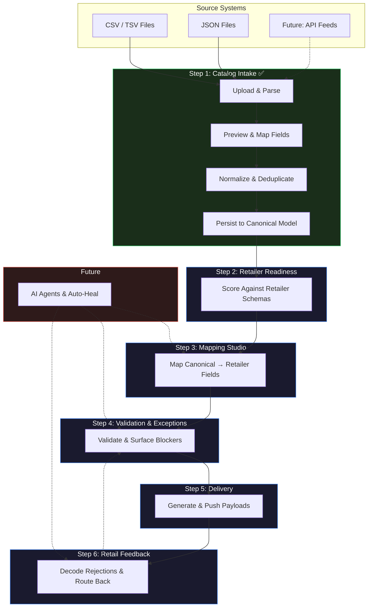

**Green** = implemented. **Blue** = prototype UI with seed data. **Red** = future.

---

## High-Level Architecture

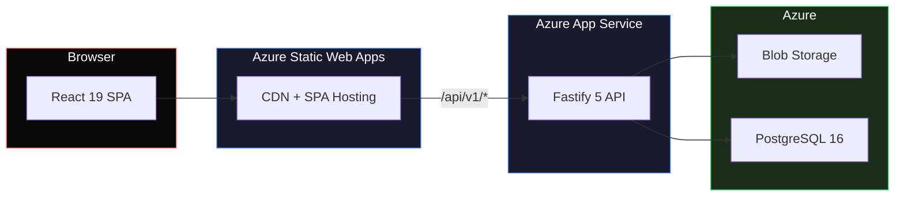

| Layer | Technology | Purpose |
|---|---|---|
| Frontend | React 19, Vite 8, React Router 7 | SPA with 6-step pipeline UI |
| Backend | Fastify 5, TypeScript 5.7 | REST API, import pipeline |
| ORM | Prisma 6 | Database access, schema management |
| Database | PostgreSQL 16 | Relational + JSONB storage |
| File Storage | Azure Blob / Local FS | Imported file preservation |
| Frontend Hosting | Azure Static Web Apps | CDN, SPA routing |
| Backend Hosting | Azure App Service | Node.js runtime |

---

## Frontend Architecture

### Route Structure

The frontend is a single-page application with six routes, one per pipeline step:

| Route | Page | Status | Data Source |
|---|---|---|---|
| `/intake` | Catalog Workspace | **Live** | CatalogRepository (API or demo) |
| `/readiness` | Retailer Readiness | Prototype | Seed data |
| `/mapping` | Mapping Studio | Prototype | Seed data |
| `/validation` | Validation & Exceptions | Prototype | Seed data |
| `/delivery` | Delivery | Prototype | Seed data |
| `/feedback` | Retail Feedback | Prototype | Seed data |

### Component Architecture

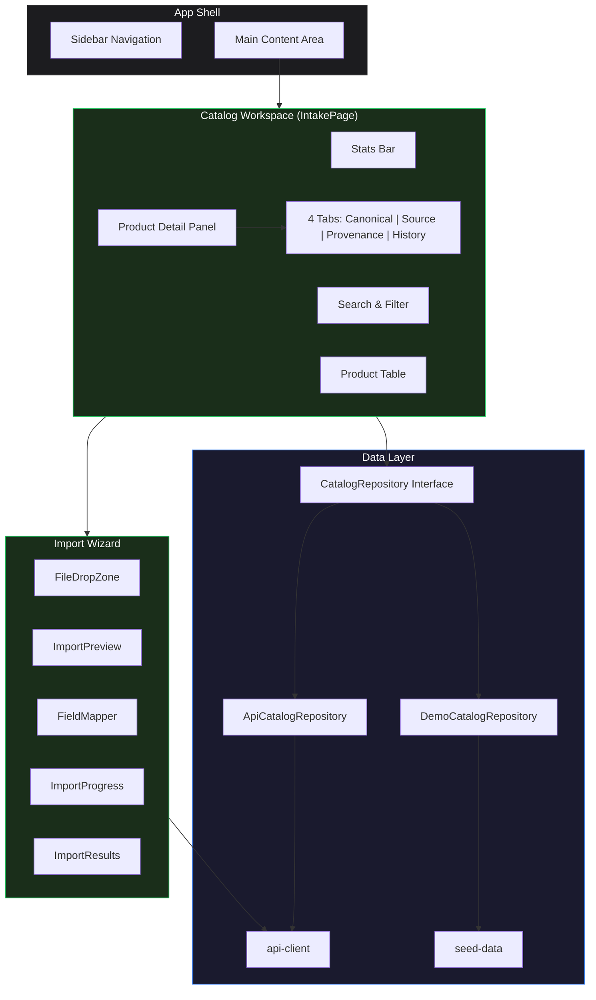

### Demo/Live Mode Resolution

The frontend automatically selects its data source at startup:

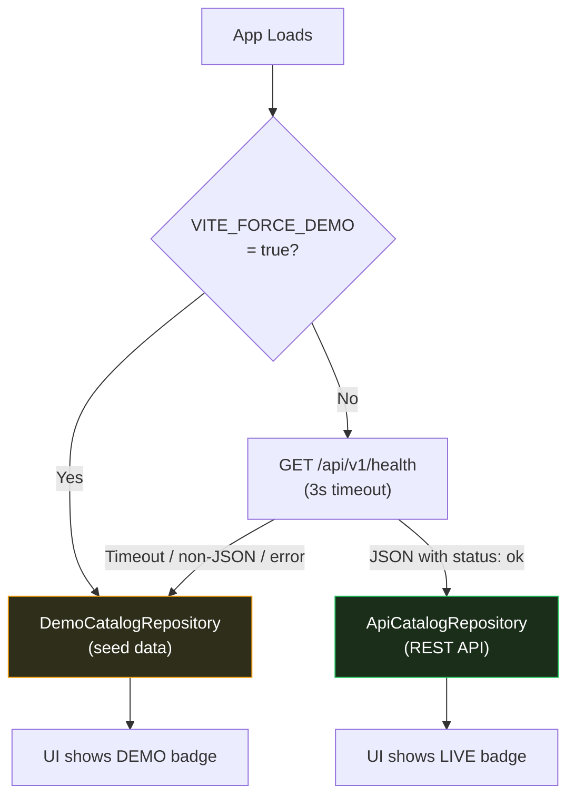

The health check validates response content type (`application/json`) and body structure (`status: "ok"`) to avoid false positives from the Vite dev server's SPA fallback, which returns 200 + HTML for unmatched routes.

---

## Backend Architecture

### Service Structure

The backend is a single Fastify process organized into layers:

```
server/
├── src/
│   ├── index.ts                    # Bootstrap, DI wiring, lifecycle
│   ├── config.ts                   # Environment-driven configuration, fail-fast validation
│   ├── types.ts                    # Fastify type augmentation
│   ├── errors/
│   │   └── api-errors.ts           # Structured error hierarchy
│   ├── auth/
│   │   ├── types.ts                # AuthProvider, TenantContext, AuthenticatedUser
│   │   ├── dev-auth-provider.ts    # Development auth (DEV_AUTH_TOKEN validation)
│   │   ├── auto-tenant-resolver.ts # Auto/explicit org resolution
│   │   ├── middleware.ts           # onRequest auth hook, request correlation
│   │   └── permissions.ts          # Role-to-permission mapping
│   ├── storage/
│   │   ├── storage.interface.ts    # StorageProvider contract
│   │   ├── azure-blob.storage.ts   # Azure Blob implementation
│   │   ├── local-fs.storage.ts     # Local filesystem implementation
│   │   ├── storage.factory.ts      # Provider selection factory
│   │   └── tenant-scoped.storage.ts# Tenant-prefixed storage wrapper
│   ├── services/
│   │   ├── import.service.ts       # Import orchestration
│   │   ├── audit.service.ts        # Append-only audit logging
│   │   ├── normalizer.ts           # Field mapping & normalization
│   │   ├── duplicate-resolver.ts   # SKU/GTIN duplicate detection
│   │   ├── history.ts              # Change tracking & serialization
│   │   └── parser/
│   │       ├── parser.types.ts     # Shared parser types
│   │       ├── csv-parser.ts       # CSV/TSV parsing
│   │       └── json-parser.ts      # JSON parsing
│   └── routes/
│       ├── health.routes.ts        # GET /health (public)
│       ├── user.routes.ts          # GET /me, GET /me/organizations (auth-only)
│       ├── catalog.routes.ts       # Catalog CRUD (tenant-scoped)
│       ├── import.routes.ts        # Import lifecycle (tenant-scoped)
│       ├── product.routes.ts       # Product queries (tenant-scoped)
│       └── organization.routes.ts  # Org settings, members, audit log (tenant-scoped)
├── prisma/
│   ├── schema.prisma               # Data model (12 tables)
│   ├── migrations/                 # 3 SQL migrations
│   ├── seed.ts                     # Dev seed (production-safe guards)
│   └── ADR-001-product-identity.md # Deferred identity decision
└── test/
    ├── fixtures/                   # Sample CSV/JSON files
    ├── unit/                       # 90 unit tests
    └── integration/                # 23 tenant-isolation tests (requires PostgreSQL)
```

### Backend Request Flow

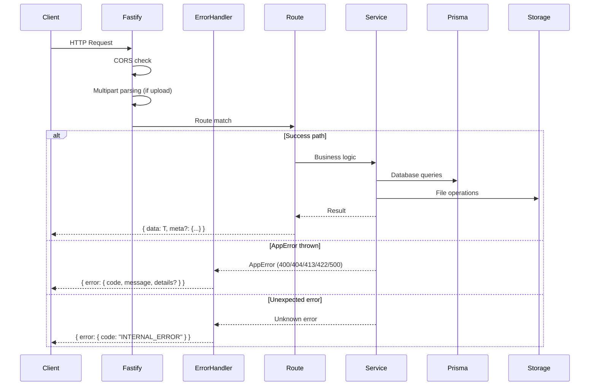

### Dependency Injection

Dependencies are wired at startup in `index.ts` and attached to the Fastify instance via `decorate()`:

| Dependency | Access Pattern | Lifecycle |
|---|---|---|
| PrismaClient | `fastify.prisma` | Created at startup, connected before listen, disconnected on shutdown |
| StorageProvider | `fastify.storage` | Created at startup via factory (Azure or local based on env), wrapped with `TenantScopedStorage` per request |
| AppConfig | `fastify.config` | Created at startup from environment variables, immutable |
| AuthProvider | `fastify.authProvider` | Created at startup (`DevAuthProvider` or JWT provider based on `AUTH_MODE`) |
| TenantResolver | `fastify.tenantResolver` | Created at startup (`AutoTenantResolver`), resolves `TenantContext` per request |

Routes access these via the Fastify instance. Services receive them as constructor parameters.

---

## Repository Structure

```
Data-Kitchen/
├── src/                            # Frontend source (React)
│   ├── App.tsx                     # Route definitions
│   ├── main.tsx                    # Entry point (BrowserRouter)
│   ├── index.css                   # Design system (CSS variables, dark theme)
│   ├── pages/                      # One page per pipeline step
│   ├── components/
│   │   ├── shell/                  # AppShell, Sidebar
│   │   └── catalog/                # Import wizard, product detail
│   └── lib/
│       ├── api-client.ts           # HTTP client for backend
│       ├── catalog-repository.ts   # Repository pattern (demo/live)
│       ├── seed-data.ts            # Demo mode data
│       └── utils.ts                # Classname helper
├── server/                         # Backend source (Fastify)
│   └── (see Backend Architecture above)
├── public/
│   └── staticwebapp.config.json    # Azure SWA routing
├── docs/architecture/              # Architecture documents
├── .github/workflows/              # CI/CD pipelines
├── package.json                    # Frontend dependencies
├── vite.config.ts                  # Vite + dev proxy
└── tsconfig.json                   # Frontend TypeScript config
```

The frontend and backend are **independent packages** — separate `package.json`, separate `tsconfig.json`, separate dependency trees. No shared code between them. The monorepo structure keeps API contracts and frontend types in the same commit history.

---

## Import Flow

The import pipeline is the core of Step 1. It is a two-phase, human-in-the-loop process:

### Phase 1: Upload & Preview

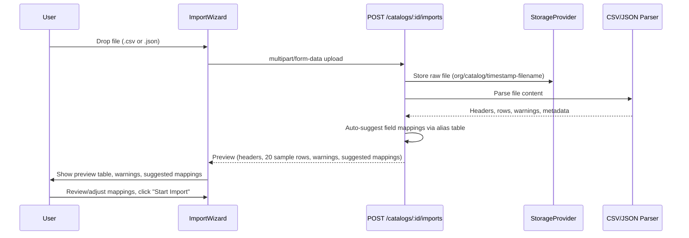

### Phase 2: Confirm & Import

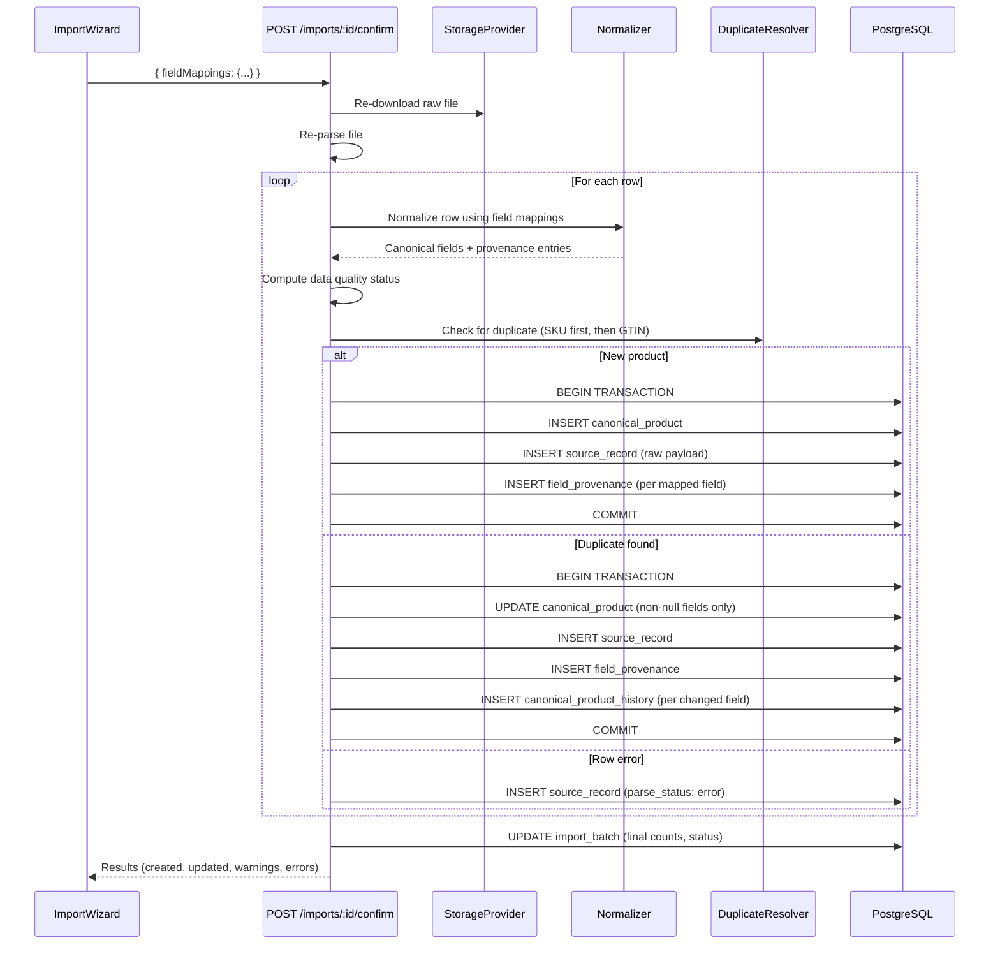

Key design properties:
- **Synchronous** — the HTTP request blocks until all rows are processed
- **Per-row transactions** — a failed row does not abort the batch
- **Non-destructive updates** — null/empty incoming values never overwrite existing data
- **Full provenance** — every field mapping creates a provenance record
- **History on update** — every changed field creates a history record

---

## Data Flow

### From Source to Canonical Product

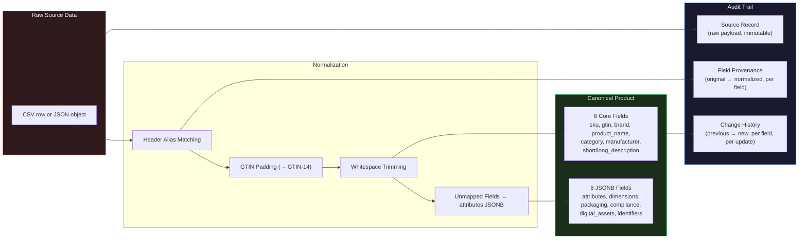

### Database Relationships

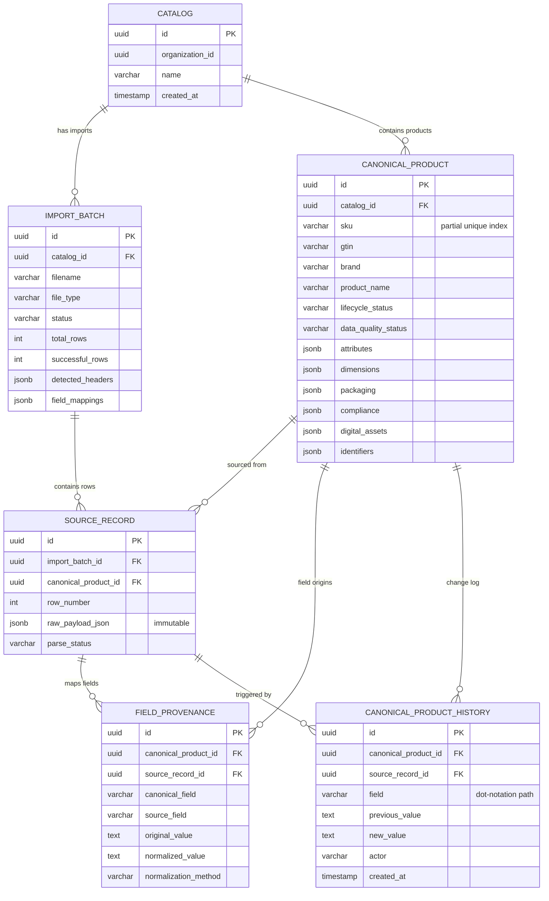

Key constraints:
- `(catalog_id, sku) WHERE sku IS NOT NULL` — partial unique index enforces SKU uniqueness within a catalog while allowing null SKUs (custom SQL; Prisma does not support `WHERE` on `@@unique`)
- `(import_batch_id, row_number)` — unique constraint prevents duplicate source records within an import
- `ON DELETE RESTRICT` on most foreign keys — prevents accidental data loss
- `ON DELETE SET NULL` on `source_record.canonical_product_id` — preserves audit trail if a product is removed

---

## Storage Architecture

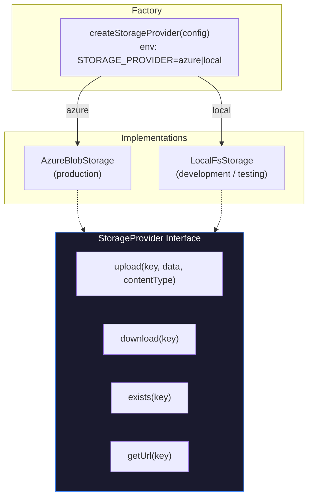

File storage key format: `{organizationId}/{catalogId}/{timestamp}-{filename}`

Files are stored once during upload and re-read during import confirmation. They are never modified or deleted — the storage layer is append-only by design, supporting audit requirements.

---

## Deployment Architecture

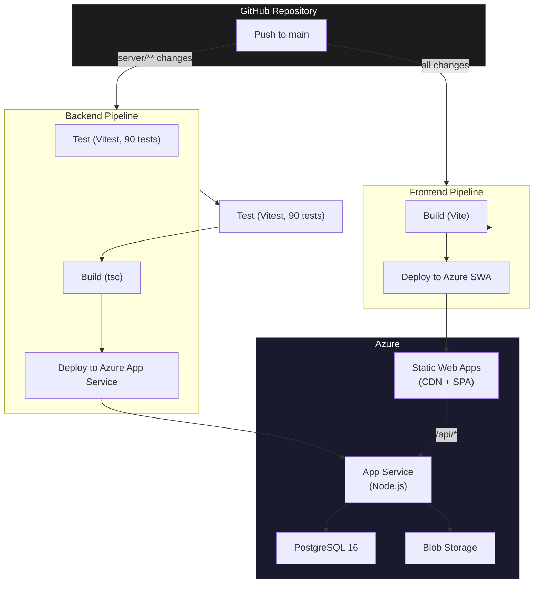

| Component | Trigger | Pipeline |
|---|---|---|
| Frontend | Any push to `main` | Build with Vite → deploy to Azure SWA (OIDC auth) |
| Backend | Push to `main` with changes in `server/**` | Run tests → build with tsc → deploy to Azure App Service |

The frontend pipeline deploys on all pushes. The backend pipeline is path-scoped to `server/**` to avoid unnecessary deploys for frontend-only changes.

### Development Environment

During local development, the Vite dev server proxies `/api/v1` requests to `localhost:3000` (the Fastify backend). If the backend is not running, the frontend automatically falls back to demo mode.

```
Browser → localhost:5173 (Vite)
                ├── /api/v1/* → proxy → localhost:3000 (Fastify)
                └── /* → SPA (React)
```

---

## Authentication and Authorization

Authentication uses a provider-neutral `AuthProvider` interface. In development, `DevAuthProvider` validates the Bearer token against the configured `DEV_AUTH_TOKEN` environment variable — incorrect, empty, or missing tokens are rejected with 401. In production, a JWT-validating provider (vendor TBD) will be wired in via `AUTH_ISSUER`, `AUTH_AUDIENCE`, and `AUTH_JWKS_URI`.

Tenant resolution is handled by `AutoTenantResolver`. For single-org users, the tenant is auto-resolved from their `OrganizationMembership`. For multi-org users, the client sends an `X-Organization-Id` header, which is validated against the user's active memberships. Supporting routes: `GET /me` (user identity) and `GET /me/organizations` (membership listing).

Authorization uses explicit role-to-permission mapping (never string comparison):
- **Roles:** `organization_admin`, `operator`, `viewer`
- **Permissions:** `catalog:read`, `catalog:write`, `product:read`, `import:execute`, `organization:manage`

Operational audit logging records security-relevant events (auth failures, catalog/import operations, org settings changes, authorization denials) in an append-only `AuditLog` table. Request correlation uses `X-Request-Id` headers propagated through requests, responses, and structured logs.

The `AUTH_MODE` environment variable controls the mode (`development` or `production`). Development mode is blocked when `NODE_ENV=production`. `DEV_AUTH_TOKEN` is required in development mode.

---

## Multi-Tenancy

The system supports logical multi-tenancy through `organization_id` on all primary tables:

| Table | Has `organization_id` | Indexed |
|---|---|---|
| `organization` | — (is the tenant) | — |
| `user` | — (cross-tenant) | `idx_user_email` |
| `organization_membership` | Yes (FK) | `uq_membership_org_user`, `idx_membership_user` |
| `catalog` | Yes (FK) | `idx_catalog_org` |
| `import_batch` | Yes (FK) | `idx_import_batch_org` |
| `canonical_product` | Yes (FK) | `idx_product_org` |
| `source_record` | No (via import_batch FK) | — |
| `field_provenance` | No (via canonical_product FK) | — |
| `canonical_product_history` | No (via canonical_product FK) | — |
| `audit_log` | Yes (FK, nullable) | `idx_audit_log_org` |

Tenant isolation is enforced at the application layer: every authenticated request resolves a `TenantContext` from the user's membership, and all queries filter by `tenantContext.organizationId`. Blob storage keys are prefixed with `organizations/{orgId}/` and enforced by `TenantScopedStorage`. PostgreSQL RLS is deferred as defense-in-depth (see MULTI_TENANCY.md).

---

## API Boundaries

All API endpoints are under `/api/v1`. The response envelope is consistent across all endpoints:

**Success:** `{ data: T, meta?: { page, limit, total, totalPages } }`
**Error:** `{ error: { code: string, message: string, details?: object } }`

### Endpoints

| Method | Path | Auth | Purpose |
|---|---|---|---|
| `GET` | `/health` | Public | Database connectivity check |
| `GET` | `/me` | Auth only | Current user identity |
| `GET` | `/me/organizations` | Auth only | User's org memberships with roles |
| `GET` | `/catalogs` | Tenant | List catalogs (auto-creates default if none) |
| `POST` | `/catalogs` | Tenant | Create a catalog |
| `GET` | `/catalogs/:id` | Tenant | Get catalog with computed stats |
| `POST` | `/catalogs/:catalogId/imports` | Tenant | Upload file, get preview + suggested mappings |
| `GET` | `/catalogs/:catalogId/imports` | Tenant | List imports for a catalog |
| `GET` | `/imports/:id` | Tenant | Get import batch details |
| `POST` | `/imports/:id/confirm` | Tenant | Execute import with field mappings |
| `GET` | `/imports/:id/results` | Tenant | Get import results with counts |
| `GET` | `/catalogs/:catalogId/products` | Tenant | List products (paginated, filterable, searchable) |
| `GET` | `/products/:id` | Tenant | Get single product |
| `GET` | `/products/:id/source-records` | Tenant | Get source records for a product |
| `GET` | `/products/:id/provenance` | Tenant | Get field provenance for a product |
| `GET` | `/products/:id/history` | Tenant | Get change history for a product |
| `GET` | `/organization` | Tenant | Get current org details |
| `PATCH` | `/organization` | Tenant | Update org settings (admin only) |
| `GET` | `/organization/members` | Tenant | List org members |
| `GET` | `/organization/audit-log` | Tenant | List audit log entries (admin only) |

### Error Codes

| HTTP Status | Code | When |
|---|---|---|
| 400 | `VALIDATION_ERROR` | Invalid request data |
| 400 | `ORGANIZATION_REQUIRED` | Multi-org user without `X-Organization-Id` header |
| 401 | `UNAUTHORIZED` | Missing or invalid authentication token |
| 403 | `FORBIDDEN` | Insufficient role permissions |
| 403 | `NO_ORGANIZATION` | User has no active memberships |
| 403 | `INVALID_ORGANIZATION` | `X-Organization-Id` not in user's memberships |
| 404 | `NOT_FOUND` | Resource does not exist (or belongs to another org) |
| 413 | `FILE_TOO_LARGE` | Upload exceeds `MAX_UPLOAD_SIZE_MB` |
| 422 | `PARSE_ERROR` | File is parseable but semantically invalid |
| 500 | `INTERNAL_ERROR` | Unexpected server error (message suppressed in production) |
| 500 | `STORAGE_ERROR` | File storage operation failed |
| 503 | (health only) | Database unreachable |

---

## Future Expansion

The architecture is designed to support the following expansions without requiring a rewrite:

### Step 2: Retailer Readiness Engine
- Requires a **Retail Intelligence Library** — structured retailer schemas, field requirements, validation rules
- Readiness scoring will query canonical products against retailer schemas
- The canonical product model and JSONB flexible fields are designed to accommodate retailer-specific attributes

### Step 3: Mapping Studio
- Field mapping rules will be persisted (currently, mappings are per-import and stored on the import batch)
- Mappings will be reusable across imports and configurable per retailer
- AI-suggested mappings will build on the existing `suggestFieldMappings()` alias table

### Step 4: Validation & Exceptions
- Validation rules will reference the Retail Intelligence Library
- Auto-heal suggestions will be generated by AI but require human approval
- Exception routing will use the canonical product's `data_quality_status` as an input signal

### Step 5: Delivery
- Payload generation will transform canonical products into retailer-specific formats
- The canonical model's typed core fields + JSONB structure supports arbitrary output schemas
- File delivery and API push capabilities will use the existing storage abstraction

### Step 6: Retail Feedback
- Retailer rejections will be ingested and parsed
- Rejections will be linked to canonical products and routed back into the validation step
- Field provenance enables tracing a rejection to its source system

### AI Agents (Step 6+)
- Source records provide training data for field mapping models
- Provenance records provide evaluation data for normalization quality
- Change history provides a feedback signal for auto-heal accuracy
- The deferred product identity layer (ADR-011) will support AI-driven product reconciliation

### Async Processing
- The synchronous import pipeline can be extracted to a job worker
- The `ImportService` class is already decoupled from the HTTP layer
- Add a job table, move `confirmImport` to a worker, change the HTTP endpoint to return a job ID

### Event-Driven Architecture
- Domain events (`ProductCreated`, `ProductUpdated`, `FieldChanged`) can be emitted from the import service
- Multiple consumers (readiness recalculation, webhook notifications, search index updates) can subscribe
- The per-row transaction boundary is the natural event emission point
